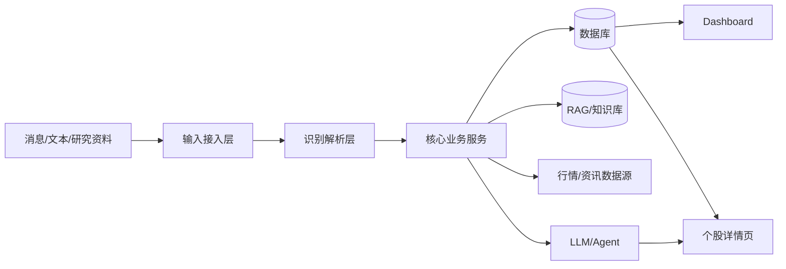
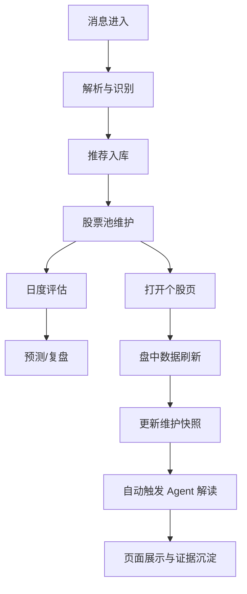

# dgq_finance_agent
## 系统设计与阶段成果汇报

- 日期：2026-03-09
- 主题：从聊天荐股记录工具升级为投研闭环平台

---

# 1. 项目要解决什么问题？

## 当前痛点

- 股票推荐信息分散在聊天、人工记录、研究资料中
- 推荐逻辑和后续结果脱节，容易遗忘
- 无法持续评估“票的质量”和“人的质量”
- 只有日线，不足以支撑盘中观察和快速判断

## 核心目标

- 自动采集
- 自动识别
- 自动跟踪
- 自动评估
- 自动展示
- 自动分析

---

# 2. 一句话介绍系统

`dgq_finance_agent` 是一个面向内部投研场景的智能金融 Agent 系统，
把聊天消息、研究资料、行情数据和 Agent 分析，整合为一个可追踪、可评估、可复盘、可汇报的平台。

---

# 3. 当前能力总览

## 已经打通的闭环

1. 输入接入：微信 webhook / 文本批量导入 / 人工录入 / 研究资料录入
2. 结构化识别：股票、荐股人、逻辑、时间抽取
3. 股票池维护：推荐持续沉淀
4. 日度评估：收益、回撤、评分、预测、复盘
5. 盘中跟踪：分钟线、逐笔、天级维护
6. Agent 解读：进入个股页自动触发盘中分析
7. 可视化：首页管理台 + 个股详情页同花顺风格展示

---

# 4. 系统总体架构

---

# 5. 技术栈

## 后端

- FastAPI
- SQLAlchemy
- APScheduler
- Python 3.9+

## 数据与模型

- SQLite / PostgreSQL
- Baostock（日线）
- Freebest = Pytdx -> AKShare（盘中）
- Site whitelist 新闻源

## 智能分析

- Ollama OpenAI 兼容接口
- `qwen2.5:3b`

## 前端

- Jinja2
- 原生 HTML/CSS/JS
- Canvas 券商式分时图

---

# 6. 关键数据对象

## 结构化主表

- `stocks`
- `recommenders`
- `recommendations`
- `daily_performance`
- `stock_predictions`
- `news_discovery_candidates`
- `intraday_bars`
- `intraday_ticks`
- `stock_daily_maintenance`

## 关键升级点

`stock_daily_maintenance` 用来承接“当天该股票的盘中状态快照”。

---

# 7. 主流程：从消息到结论

---

# 8. 日度能力

## 系统每天做什么

- 拉取日线行情
- 计算收益、回撤、评分
- 更新股票池状态
- 输出每日跟踪记录
- 生成预测与后续复盘依据
- 扫描新闻候选股票

## 价值

- 把“是否赚钱”变成可量化指标
- 把“逻辑是否成立”变成可持续跟踪对象

---

# 9. 盘中能力（本轮重点）

## 已增强内容

- 免费盘中数据方案落地
- 支持 1 分钟线
- 支持逐笔成交
- 数据本地落库
- 个股页直接绘制
- 天级维护快照
- 自动盘中 Agent 解读

## 当前主方案

- `pytdx` 主源
- `AKShare` 回退
- 组合名：`freebest`

---

# 10. 盘中前端呈现效果

## 个股详情页已具备

- 同花顺风格分时图
- 价格线 / 均价线
- 昨收 / 0% 基准线
- 右侧涨跌幅刻度
- 成交量柱
- 逐笔成交列表
- 天级股票信息维护
- 自动触发的 Agent 盘中解读

## 意义

从“表格跟踪”升级为“交易型看板”。

---

# 11. Agent 在系统中的位置

## 已落地角色

- 输入解析 Agent
- 日评/复盘 Agent
- 预测引擎
- 个股页盘中解读 Agent

## 盘中页动作

用户进入个股页后：

1. 自动拉取实时盘中数据
2. 更新分钟线/逐笔/维护快照
3. 自动生成盘中解读
4. 写回系统，供展示和后续分析复用

---

# 12. 当前成果亮点

## 业务层面

- 推荐不再丢
- 逻辑可跟踪
- 人和票都可评价
- 盘中状态可直接查看

## 技术层面

- 多数据源可替换
- API / Web / Agent 多入口统一
- 天级 + 分钟级 + 逐笔级融合
- LLM 已嵌入实际业务链路

---

# 13. 已验证结果

## 真实验证项

- 东山精密 `002384` 2026-03-05 全日盘中数据冒烟测试完成
- 1 分钟线与逐笔数据已验证可取
- 个股详情页已可直接展示盘中数据
- 自动盘中解读链路已打通
- 回归测试通过

---

# 14. 当前约束与风险

## 风险点

- 免费数据源稳定性有限
- 不同源字段口径有差异
- 盘中刷新会增加页面耗时
- 本地轻量模型分析深度有限

## 当前处理方式

- 多源回退
- 单位自动识别
- 维护快照落库
- LLM 失败时回退事实摘要

---

# 15. OpenClaw 对系统的价值

## 它解决什么问题？

OpenClaw 不是行情源，而是“机器人/Agent 通道层”。

## 它的加成

- 把系统能力通过机器人通道暴露出去
- 适合做 Telegram 等外部会话交互入口
- 让用户能在聊天环境里查询、触发、接收结果
- 减少手工打开后台的频率

## 适合的场景

- 远程接收告警
- 远程触发 Agent 指令
- 做轻量协作入口

---

# 16. OpenClaw 是否必须？

## 结论

不是必须，但有加成。

### 不上 OpenClaw 时

系统仍然能运行：

- Web 页面可用
- API 可用
- 微信/文本导入可用
- 评估和盘中功能可用

### 上 OpenClaw 时

系统多了一个“聊天式操作入口”和“通知出口”。

---

# 17. 是否需要购买云服务？

## 当前阶段结论

### 可不买云

如果你当前目标是：

- 内部验证
- 本地演示
- 小范围使用
- 手动启动服务

那么一台本地机器就够。

### 建议上云的时机

- 需要 7x24 小时运行
- 需要稳定 webhook/机器人在线
- 需要多人远程访问
- 需要长期保留任务调度和消息通道

---

# 18. 云资源建议

## 最小可行配置

- 2C4G 云主机
- Docker + PostgreSQL
- 可选反向代理

## 如果只做当前系统

- OpenClaw 本身不要求必须采购额外高算力
- LLM 可继续用本地 Ollama
- 若后续要更强模型，再考虑独立模型服务或 API

---

# 19. 下一阶段路线图

## P1 稳定性

- 盘中刷新缓存与节流
- 数据源熔断与回退
- 运行监控

## P2 分析增强

- 更结构化的盘中解读
- 板块/资金流联动
- 更强模型接入

## P3 管理增强

- 荐股人画像
- 股票生命周期档案
- 汇报指标大盘

---

# 20. 汇报结论

## 结论一句话

系统已完成从“消息记录”到“投研闭环”的升级。

## 当前阶段定位

- 功能已打通
- 价值已形成
- 下一步重点是稳定性、精细化和组织级使用方式

## 可直接汇报

- 有架构
- 有数据
- 有页面
- 有 Agent
- 有盘中能力
- 有后续演进路线
