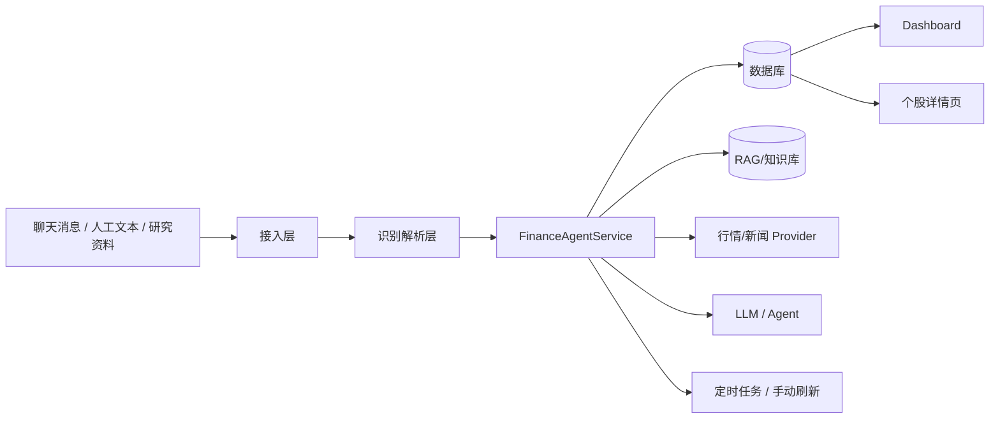

marp: true
theme: default
paginate: true
size: 16:9
title: dgq_finance_agent 技术评审汇报
style: |
    section {
        font-size: 26px;
        line-height: 1.35;
    }
    h1 {
        font-size: 1.55em;
        margin-bottom: 0.25em;
    }
    h2 {
        font-size: 1.0em;
        margin-top: 0.3em;
        margin-bottom: 0.2em;
    }
    h3 {
        font-size: 0.82em;
        margin-top: 0.25em;
        margin-bottom: 0.15em;
    }
    ul, ol {
        margin-top: 0.15em;
        margin-bottom: 0.15em;
    }
    li {
        margin: 0.10em 0;
    }
    code {
        font-size: 0.82em;
    }
---

# dgq_finance_agent
## 技术评审版汇报（细化逻辑版）

- 日期：2026-03-09
- 目标：讲清技术方案、实现深度、当前问题

---

# 1. 项目目标

## 想解决的不是“看盘”本身

- 解决聊天荐股信息易丢失
- 解决推荐逻辑难追踪
- 解决荐股人质量无法量化
- 解决日线级跟踪无法覆盖盘中变化

## 最终目标

消息输入 → 结构化识别 → 股票池沉淀 → 日评估 → 盘中刷新 → Agent 解读 → 排序与输出

---

# 2. 总体架构图

## 结论

- 平台型结构，不是单页应用
- 核心逻辑集中在服务编排层

---

# 3. 核心模块划分

## 后端主模块

- `app/main.py`：路由与入口
- `app/services.py`：业务编排中心
- `app/providers.py`：数据源抽象层
- `app/models.py`：ORM 模型层
- `app/input_parser_agent.py`：输入理解
- `app/analysis_agent.py`：分析摘要
- `app/decision_engine.py`：预测判断

## 当前状态

- 模块边界基本清晰
- 但 `services.py` 已明显偏重

---

# 4. 数据模型总览

## 关键结构化资产

- `stocks`
- `recommenders`
- `recommendations`
- `daily_performance`
- `stock_predictions`
- `news_discovery_candidates`
- `intraday_bars`
- `intraday_ticks`
- `stock_daily_maintenance`

## 设计意图

- 推荐、评估、预测、盘中、维护五层信息均可落库

---

# 5. 关键模型：`stock_daily_maintenance`

## 它为什么重要

它不是简单缓存，而是“某只股票某个交易日的盘中状态快照”。

## 主要承载内容

- 基准价 / 昨收
- 最新价、涨跌额、涨跌幅
- 均价、高低点
- 成交量、成交额
- bar/tick 数量
- 主买主卖统计
- `payload_json` 扩展信息

## 价值

- 让盘中数据从“瞬时展示”升级为“当天画像沉淀”

---

# 6. 输入链路：前端点提交后先发生什么

## 前端入口

- Dashboard 股票消息导入表单
- 提交到 `/manual/import`

## 后端入口

- 路由接收 `raw_text`
- 调用 `ingest_bulk_text()`

## 设计原则

- 不直接写库
- 先做标准化解析
- 再根据识别结果分流

---

# 7. 输入链路：格式拆解层

## `ingest_bulk_text()` 第一层逻辑

`_extract_bulk_records()` 依次尝试：

1. JSON
2. CSV
3. 自由文本

## 当前支持的真实输入样式

- `张三：600519 看好...`
- 微信复制样式：`张三 时间` + 下一行正文
- JSON 数组
- CSV 表头批量导入

## 已做到什么程度

- 能适配真实业务里的半结构化输入

---

# 8. 输入链路：推荐识别三层机制

## `_parse_recommendations()` 的顺序

### 第一层：LLM 识别

- 判断消息类型
- 提取逻辑摘要
- 提取股票代码 / 名称

### 第二层：规则解析

- 走 `MessageParser`
- 保证稳定性

### 第三层：兜底抽取

- 只提取代码或股票名
- 尽量不丢线索

---

# 9. 输入链路：LLM 到底做了什么

## `LLMInputParserAgent` 当前输出结构

- `message_type`
- `confidence`
- `logic_summary`
- `stocks[]`

## 可识别类型

- `recommendation`
- `tracking_update`
- `research`
- `macro`
- `noise`

## 做到什么程度

- 已经能把自然语言消息变成结构化对象
- 不只是识别代码，还能判断消息语义属性

---

# 10. 输入链路：识别结果怎么入系统

## 路径 A：识别为推荐

进入 `ingest_message()`：

1. 创建/复用 `Stock`
2. 创建/复用 `Recommender`
3. 去重校验
4. 新建 `Recommendation`
5. 写入股票知识库

## 路径 B：不构成推荐

- 进入 `_save_research_note()`
- 作为 RAG 资料沉淀

## 当前程度

- 已实现“推荐”和“研究资料”双通道沉淀

---

# 11. 输入部分：当前问题与待优化项

## 已知短板

- 股票别名/简称映射仍可增强
- 低置信度消息没有人工审核流
- 前端缺少“识别预览后确认”能力
- 多股票、多逻辑拆分还可更细

## 结论

- 输入层主链路已经打通
- 下一步重点是精细化与可审计性

---

# 12. “一键抓取并更新”前端是怎么设计的

## 前端动作

- 点击 `🔄 一键抓取并更新`
- 提交到 `/manual/refresh`

## 后端动作

- 不阻塞页面
- 启动后台线程
- 立即返回页面状态提示

## 为什么这样设计

- 防止页面长时间等待
- 防止重复点击重入

---

# 13. “一键抓取并更新”后台总流程

## `_run_manual_refresh()` 的执行顺序

1. `cleanup_invalid_market_data()`
2. `run_news_discovery_scan()`
3. `evaluate_all_recommendations()`

## 影响到的结果层

- 日评估数据
- 预测结果
- 荐股人分数
- 股票池显示
- 日报与结论更新

---

# 14. 清洗逻辑：刷新前为什么先清理数据

## `cleanup_invalid_market_data()` 作用

- 清理无效周末日评估
- 清理无效预测记录

## 设计目的

- 防止交易日判断错误污染结果
- 保证后续评估基于干净数据集运行

## 做到什么程度

- 已有刷新前数据净化动作

---

# 15. 新闻扫描逻辑：刷新时为什么还要扫新闻

## `run_news_discovery_scan()` 的作用

- 从白名单站点抓取资讯
- 识别股票候选事件
- 保存候选新股或更新已有跟踪对象

## 它不是可有可无的

- 用于主动发现候选研究标的
- 用于辅助逻辑验证与补充上下文

## 做到什么程度

- 系统已从“被动接收推荐”升级为“有一定主动发现能力”

---

# 16. 日评估总逻辑：每天到底跑了什么

## `evaluate_all_recommendations()` 主流程

对所有活跃推荐逐只执行：

1. 拉取日线快照
2. 逻辑新闻验证
3. 计算日评分
4. 生成 AI 分析摘要
5. 更新预测
6. 更新推荐状态
7. 全局刷新荐股人评分
8. 生成日报和结论更新

## 当前程度

- 已形成完整日度闭环

---

# 17. 股票评分逻辑：SQS 的公式结构

## 当前公式

$$
SQS = 0.6 \times 盈利能力 + 0.2 \times 逻辑验证 + 0.2 \times 量化指标
$$

## 含义

- 盈利能力：收益、峰值收益、Sharpe、回撤惩罚
- 逻辑验证：新闻是否验证原逻辑
- 量化指标：市值、弹性、流动性

## 做到什么程度

- 已具备明确评分公式，不是主观描述

---

# 18. 股票评分逻辑：当前问题在哪

## 当前优点

- 结构清晰
- 可复算
- 可解释

## 当前问题

- 权重仍偏经验设定
- 逻辑验证仍较粗粒度
- 尚未系统纳入板块、资金流、概念联动因子

## 结论

- 当前 SQS 已可用，但仍处于“工程可运行、策略待增强”阶段

---

# 19. 荐股人评分逻辑：RRS 的真实计算方式

## `refresh_recommender_scores()` 做了什么

系统遍历每个荐股人的历史推荐，提取：

- 最新收益率
- 最大回撤
- 距今天数

然后进入 `compute_recommender_reliability()`。

## 核心机制

- 90 天半衰期时间衰减
- 近期表现权重大于远期表现
- 综合平均回报、命中率、平均回撤

---

# 20. 荐股人评分逻辑：做到什么程度，还有什么问题

## 已做到

- 已有自动评分
- 已有排名输出
- 已纳入股票机会排序因子

## 当前问题

- 还没有正式前端人工调分机制
- `reliability_score` 会被自动重算覆盖

## 推荐后续方案

- `manual_score_delta`
- 或 `manual_score_override`
- 推荐“双轨机制”：自动评分 + 人工校正分

---

# 21. 股票排序逻辑：不是按涨跌幅简单排

## 当前有两种排序语义

### 股票池跟踪视图

- 展示最新评分、收益、状态、荐股人分数

### 机会排序

综合：

1. `opportunity_score`
2. `latest_score`
3. `prediction_confidence`
4. `recommender_score`

## 结论

- 已具备“综合排序”而不是“单指标排序”

---

# 22. 实盘数据获取：当前到底用了哪些技术

## 日线层

- `baostock`
- 用于日度评估、回撤、预测复盘

## 盘中层

- `freebest = pytdx -> AKShare`
- `pytdx` 主源
- `AKShare` 回退

## 已实现能力

- 1 分钟线
- 逐笔成交
- 成交量/成交额
- 本地落库与批量同步

---

# 23. 实盘数据链路：获取后如何标准化

## 处理顺序

1. Provider 拉取原始分钟线/逐笔
2. 转为统一内部结构
3. 写入 `intraday_bars` / `intraday_ticks`
4. 构建 `stock_daily_maintenance`
5. 页面与 Agent 共用同一结果

## 已解决的问题

- 成交量单位“股/手”差异
- 均价失真
- 百分比刻度异常

## 当前程度

- 已形成可复用的盘中数据标准化链路

---

# 24. 实盘数据部分：当前缺陷

## 主要缺陷

- 免费源稳定性有限
- 字段口径不完全统一
- 页面访问会受外部源耗时影响
- 不适合要求严格 SLA 的交易级场景

## 结论

- 当前更适合投研辅助、盘中观察、汇报展示

---

# 25. 个股页逻辑：用户打开页面时内部发生什么

## `get_stock_detail()` 的执行链

1. 读取股票基础信息和历史推荐
2. 读取存储的分时与逐笔
3. 自动触发 `refresh_stock_realtime_context()`
4. 更新分钟线、逐笔、维护快照
5. 自动触发盘中 Agent 解读
6. 把结果交给模板渲染

## 结论

- 个股页不是静态查询页，而是动态分析页

---

# 26. 前端展示逻辑：已经做到什么程度

## 个股页已实现要素

- 同花顺风格分时图
- 价格线 / 均价线
- 昨收 / 0% 基准线
- 涨跌幅刻度
- 成交量柱
- 逐笔成交列表
- 天级维护卡片
- 自动盘中 Agent 解读

## 当前程度

- 已具备“交易型观察界面”雏形

---

# 27. Agent 逻辑：当前不是演示能力，而是业务链路能力

## 当前接入的 Agent

- 输入解析 Agent
- 盘中/复盘分析 Agent
- 决策引擎

## 盘中 Agent 工作流

1. 读推荐逻辑
2. 读最新日评估
3. 读知识库上下文
4. 读盘中维护快照
5. 组装证据包
6. 调用本地 LLM
7. 失败回退 factual summary
8. 成功结果写回数据库

---

# 28. 当前完成度：可以明确说已经做到了什么

## 输入侧

- 多格式导入
- LLM + 规则双通道识别
- 推荐与研究资料双沉淀

## 日评侧

- 股票评分
- 荐股人评分
- 预测与复盘

## 盘中侧

- 分钟线
- 逐笔
- 落库
- 页面展示
- Agent 解读

---

# 29. 当前主要问题：这套系统的短板是什么

## 工程层

- `services.py` 过大
- 域边界还可继续拆分

## 数据层

- 免费源波动
- 字段口径需要持续维护

## 交互层

- 输入没有预览确认
- 低置信度缺少审核流

## 性能层

- 个股页查询即刷新，响应时间不稳定

---

# 30. 下一阶段路线图

## 第一阶段：稳定性工程化

1. 服务拆分
2. Provider 健康探测
3. 熔断与回退
4. 盘中缓存与节流

## 第二阶段：识别与分析增强

1. 输入预览审核流
2. 名称映射增强
3. Agent 输出结构化
4. 盘中维护快照纳入排序

## 第三阶段：研究价值增强

1. 更强回测
2. 评分校准
3. 板块/资金流联动

---

# 31. 最终结论

## 一句话结论

`dgq_finance_agent` 已完成从“消息记录工具”到“投研闭环平台原型”的跨越。

## 当前阶段定位

- 主链路已打通
- 关键能力已验证
- 下一步重点是稳定性、工程化、精细化
2. `latest_score`
3. `prediction_confidence`
4. `recommender_score`

## 当前做到的程度

- 已不是简单按涨幅排序，而是“股票质量 + 预测 + 信息源”的综合排序

## 当前问题

- 盘中维护快照还未正式纳入机会排序因子

---

# 15. 实盘数据获取逻辑：当前到底用了什么技术

## 当前市场数据架构

### 日线

- 主源：`baostock`
- 用于日度评估、收益率、回撤、状态机、预测复盘

### 盘中

- 当前组合：`freebest = pytdx -> AKShare`
- 主源优先 `pytdx`
- 回退源 `AKShare`

## 当前已实现能力

- 1 分钟线抓取
- 逐笔抓取
- 本地落库
- 批量同步
- 页面直接绘制

## 当前做到的程度

- 分时不再是“调用接口看一下”，而是形成完整数据链路

---

# 16. 盘中数据逻辑：获取后如何标准化与落库

## 盘中数据进入系统后的处理顺序

1. Provider 拉取分钟线/逐笔
2. 统一转为内部 `IntradayBar` / `IntradayTrade` 结构
3. 写入 `intraday_bars` / `intraday_ticks`
4. 构建 `stock_daily_maintenance`
5. 页面和 Agent 共用该结果

## 解决过的关键问题

- 免费源成交量单位不统一（股 / 手）
- 前后端均价计算偏差
- 百分比刻度异常

## 当前做到的程度

- 已实现数据标准化
- 已实现口径自动识别
- 已支持复用存储数据而不是每次重新抓取

---

# 17. 个股页逻辑：打开详情页时系统内部发生什么

## `get_stock_detail()` 的真实执行链

1. 读取股票基本信息与历史推荐
2. 读取存储的分时/逐笔
3. 自动触发 `refresh_stock_realtime_context()`
4. 拉取最新盘中分钟线和逐笔
5. 更新 `stock_daily_maintenance`
6. 调用 `build_intraday_agent_analysis()`
7. 将解读文本写回维护快照
8. 把所有上下文交给模板渲染

## 当前做到的程度

- 个股页已经不是静态详情页，而是“查询即刷新 + 查询即分析”的动态页

## 当前问题

- 页面访问会触发真实刷新，因此耗时受外部源和 LLM 影响

---

# 18. 前端展示逻辑：页面不只是显示数据，而是在做交易型呈现

## 已实现的同花顺风格要素

- 价格线
- 均价线
- 昨收 / 0% 基准线
- 右侧涨跌幅百分比刻度
- 成交量柱
- 逐笔成交列表
- 天级股票信息维护
- 自动盘中 Agent 解读

## 技术细节

- 原生 Canvas 绘制
- 页面预加载 JSON 数据
- 参考价按昨收对称绘制
- 成交量倍率自动识别

## 当前做到的程度

- 已具备“券商 App 式观察界面”雏形

---

# 19. Agent 逻辑：当前不是概念接入，而是已经进入业务主流程

## 已接入的 Agent 能力

- 输入解析 Agent
- 盘中/复盘分析 Agent
- 决策引擎

## 盘中 Agent 的真实工作流

1. 读取最新推荐逻辑
2. 读取最新日评估
3. 读取 RAG/知识库上下文
4. 读取最新盘中维护快照
5. 组装 evidence bundle
6. 调用本地 LLM
7. 失败时回退 factual summary
8. 成功结果写回维护快照

## 当前做到的程度

- Agent 已从“辅助工具”变成“页面逻辑的一部分”

---

# 20. 当前完成度总结：已经做到了什么程度

## 输入侧

- 已支持多格式批量导入
- 已支持 LLM + 规则双通道识别
- 已支持推荐/研究资料双路径沉淀

## 日评侧

- 已支持全量推荐每日评估
- 已支持股票评分、荐股人评分、预测与复盘

## 盘中侧

- 已支持分钟线、逐笔、落库、前端展示、Agent 解读

## 平台侧

- 已有 API、页面、手动刷新、定时调度、Webhook 接入口

---

# 21. 当前主要问题：系统还有哪些技术短板

## 工程问题

- `services.py` 过大，维护成本上升
- 部分逻辑仍集中在单服务文件中，后续拆分势在必行

## 数据问题

- 免费源稳定性波动不可避免
- 字段口径统一需要持续维护

## 交互问题

- 输入缺少预览确认
- 低置信度结果缺少人工审核流

## 性能问题

- 个股页查询即刷新，响应时间波动较大

## 策略问题

- 股票评分、荐股人评分权重仍偏经验值
- 缺少更系统的回测校准

---

# 22. 下一阶段技术路线：应该继续往哪里做

## 第一阶段：稳定性工程化

1. 拆分服务层
2. 增加 provider 健康检查与熔断
3. 增加盘中缓存与节流
4. 增加运行日志与监控面板

## 第二阶段：识别与分析增强

1. 输入预览审核流
2. 股票名称映射增强
3. Agent 输出结构化
4. 盘中维护快照进入排序因子

## 第三阶段：研究价值增强

1. 更强回测与评分校准
2. 板块/资金流/概念联动
3. 荐股人人工校正机制

---

# 23. 最终结论：这套系统现在处于什么阶段

## 一句话结论

`dgq_finance_agent` 已经完成从“消息记录工具”到“投研闭环平台原型”的跨越。

## 技术上已经具备

- 结构化输入识别
- 日度自动评估
- 盘中真实数据链路
- 个股页动态刷新
- Agent 自动分析
- 股票与荐股人排序基础

## 当前阶段定位

- 功能主链路已打通
- 关键能力已验证
- 下一步重点不是“有没有功能”，而是“稳定性、工程化、精细化”
