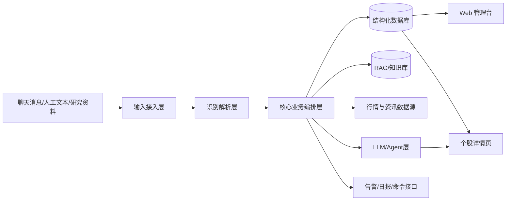
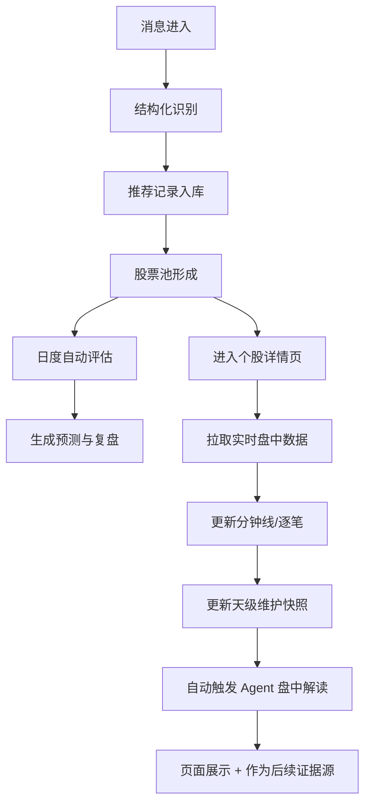

# dgq_finance_agent 系统级设计与汇报说明

日期：2026-03-09

## 1. 项目定位

`dgq_finance_agent` 是一个面向内部投研/荐股跟踪场景的智能金融 Agent 系统，目标是把分散在聊天、人工记录和公开资讯中的股票观点，沉淀为可追踪、可评估、可复盘、可解释的研究资产。

系统当前已经从“消息收集工具”升级为“投研闭环平台”，覆盖以下 5 个层次：

1. 输入采集：微信群/复制文本/人工录入/研究资料录入
2. 结构化识别：股票、荐股人、逻辑、时间、证据提取
3. 天级跟踪：股票池维护、日度评估、信息源评估、预测复盘
4. 盘中跟踪：分钟线、逐笔、天级盘中维护、实时详情页展示
5. Agent 分析：进入个股页自动触发盘中解读，形成可回写的分析结论

---

## 2. 一句话汇报版本

本系统已具备“消息进入即入池、每日自动评估、盘中自动刷新、个股页自动分析、结果可视化展示”的闭环能力，核心价值是帮助团队沉淀历史推荐、识别高质量逻辑与高可靠信息源，并用免费数据源尽可能稳定地补足盘中交易信息。

---

## 3. 当前系统解决的核心问题

### 3.1 业务痛点

- 股票推荐来自聊天、群消息、研报摘录，容易散失
- 过去推荐过的好票缺乏持续跟踪，容易“记得推荐，不记得结果”
- 很难判断“哪类逻辑有效、哪个人更可靠、什么场景下更容易赚钱”
- 传统日线级追踪无法覆盖盘中信息，无法及时分析强弱变化
- 人工复盘成本高，且结论难以标准化沉淀

### 3.2 当前系统对应方案

- 用 webhook/批量导入承接消息输入
- 用 LLM + 规则做推荐识别与结构化抽取
- 用数据库维护股票池、推荐、日评估、盘中数据、预测与维护快照
- 用免费行情源补足日线与分时
- 用 Web 个股页按券商/同花顺风格直接展示盘中走势
- 用 Agent 自动生成天级/盘中解读，回写为后续分析证据

---

## 4. 总体架构

### 4.1 技术栈

- 后端框架：FastAPI
- 业务编排：`FinanceAgentService`
- 数据层：SQLAlchemy ORM
- 数据库：SQLite（本地）/ PostgreSQL（部署）
- 定时任务：APScheduler
- LLM：Ollama OpenAI 兼容接口，当前使用 `qwen2.5:3b`
- 日线行情：`baostock`
- 盘中行情：`freebest = pytdx -> AKShare`
- 新闻源：`sites` 白名单聚合 / `tushare` / `webhook` / `mock`
- 前端：Jinja2 + 原生 HTML/CSS/JavaScript + Canvas
- 连接器：Wechaty/OpenClaw webhook 对接

---

## 5. 分层设计说明

## 5.1 输入接入层

### 输入来源

1. 微信/机器人转发：`POST /api/connectors/wechat/webhook`
2. 文本批量导入：`POST /api/messages/import_text`
3. 手工录入推荐：`POST /api/recommendations/manual`
4. 研究资料录入：`POST /api/research/ingest`
5. 页面表单入口：`/manual/import`、`/manual/research`

### 设计目标

- 保证“先入库、不丢数据”
- 支持低成本接入外部机器人和中间件
- 自动区分“荐股消息”和“资讯材料”

---

## 5.2 识别解析层

### 核心能力

- 识别股票代码/名称
- 识别荐股人、时间、原始消息
- 提取推荐逻辑摘要
- 对未显式给出代码但提到股票名称的消息先落库保全
- 将非荐股资讯沉淀到 RAG/知识库，供后续分析调用

### 当前实现方式

- 规则识别：代码正则、股票名称匹配、格式解析
- LLM 识别：用于自然语言输入理解与逻辑抽取
- 结果沉淀：推荐记录 + 研究资料双通道存储

---

## 5.3 核心业务编排层

核心服务对象是 `FinanceAgentService`，承担系统主流程编排：

- 消息入库
- 股票池维护
- 日度评估
- 新闻扫描
- 预测生成与复盘
- 盘中刷新
- 天级维护快照更新
- Agent 盘中解读写回
- 页面数据组装

### 核心业务流程

---

## 5.4 数据层设计

### 核心结构化表

- `stocks`：股票基础信息
- `recommenders`：荐股人信息
- `recommendations`：推荐记录
- `daily_performance`：日度表现与评分
- `stock_predictions`：预测与复盘结果
- `news_discovery_candidates`：新闻扫描候选
- `alert_subscriptions`：告警订阅
- `intraday_bars`：分钟线
- `intraday_ticks`：逐笔成交
- `stock_daily_maintenance`：天级股票维护快照

### `stock_daily_maintenance` 的意义

这是本轮系统升级的关键中间层，用来把盘中实时信息沉淀为“当天对该股的结构化快照”，包括：

- 基准价/昨收
- 最新价、涨跌额、涨跌幅
- 均价、高低点
- 成交量、成交额
- 分钟线数量、逐笔数量
- 主买/主卖统计
- 自动生成的盘中摘要
- `payload_json` 中扩展写入 Agent 盘中解读

这使得系统从“仅展示实时数据”升级为“持续维护盘中状态”。

---

## 5.5 市场数据层设计

### 日线能力

- 主源：`baostock`
- 用途：每日评估、收益率、回撤、日级复盘、历史回测

### 盘中能力

- 主方案：`freebest`
- 组合实现：`pytdx -> AKShare`
- 数据类型：
  - 1 分钟线
  - 全量逐笔（在可取范围内）
  - 买卖方向、量价、成交额等

### 设计原则

- 优先免费
- 优先稳定
- 优先可回落
- 优先本地落库，降低重复拉取成本

### 已验证结果

针对东山精密 `002384` 的 `2026-03-05` 冒烟测试已完成，已验证：

- 1 分钟线完整可取
- 全日逐笔可取
- 文档已落地：`design_docs/smoke_tests/002384_2026-03-05_intraday_smoke_test.md`

---

## 5.6 新闻与发现层

### 作用

- 不只追踪“别人推荐的股票”
- 还能从白名单财经站点主动发现候选股票

### 当前能力

- 站点白名单扫描
- 候选新股打分
- 自动/手工晋升为跟踪标的
- 结果参与股票池扩展

这意味着系统不是单纯的“消息记录器”，而是具备一定主动发现能力的研究平台。

---

## 5.7 Agent / LLM 分析层

### 已落地能力

1. 输入识别 Agent
2. 日度分析 Agent
3. 决策/预测引擎
4. 个股详情页自动盘中解读

### 当前盘中 Agent 的工作方式

当用户打开个股页时：

1. 自动刷新该股实时盘中数据
2. 更新 `stock_daily_maintenance`
3. 读取最新推荐逻辑、最新日评估、RAG 记忆与盘中快照
4. 自动触发盘中解读
5. 将解读文本写回 `payload_json`
6. 页面展示“进入页面自动触发的 Agent 盘中解读”

### 价值

- 从“看图”升级为“图 + 结论 + 风险提示”
- 分析过程可追踪、可回写、可复用
- 为后续策略学习和荐股人评估积累机器可读证据

---

## 5.8 展示与交互层

### Dashboard

首页用于展示：

- 股票池跟踪视图
- 每日迭代表
- 批量导入入口
- 研究资料录入入口
- 手工刷新入口

### 个股详情页

个股页已升级为券商/同花顺风格盘中看板，支持：

- 价格线
- 均价线
- 昨收 / 0% 基准线
- 右侧涨跌幅百分比刻度
- 成交量柱
- 逐笔成交列表
- 自动刷新
- 天级股票信息维护展示
- 进入页面自动触发的 Agent 盘中解读

### 设计意义

这使系统从“表格化跟踪”升级为“交易型观察界面”，更贴近实际盯盘和汇报习惯。

---

## 6. 当前闭环能力总结

系统已经形成如下完整闭环：

### 闭环 1：输入闭环

消息/文本/研究资料 → 自动识别 → 入库 → 股票池更新

### 闭环 2：日评闭环

股票池 → 自动获取日线 → 每日评估 → 预测/复盘 → 日报/列表输出

### 闭环 3：盘中闭环

进入个股页 → 拉取实时盘中数据 → 更新分钟线/逐笔/维护快照 → 自动触发 Agent 解读 → 页面展示

### 闭环 4：知识沉淀闭环

推荐逻辑 + 研究资料 + 日评结果 + 盘中维护 + Agent 解读 → 汇总为后续分析证据

---

## 7. 当前系统亮点

### 7.1 真正解决了“历史推荐会遗忘”的问题

每一条推荐都已变成可检索、可评估、可复盘的数据对象。

### 7.2 盘中数据能力已明显增强

不仅有日线，还具备分钟级与逐笔级信息获取、落库和前端绘制能力。

### 7.3 形成了“天级维护层”

这是系统区别于普通看盘工具的重要能力：它不是只展示行情，而是在持续维护“当天这个股票的状态画像”。

### 7.4 Agent 已经进入生产流程

Agent 不再只是离线分析工具，而是已嵌入个股详情页实时流程中。

### 7.5 免费方案可运行

当前关键行情链路尽量采用免费、可替代的数据源，降低早期试错成本。

---

## 8. 当前约束与风险

### 8.1 免费数据源存在稳定性波动

- 免费接口可能限频、变更、偶发失效
- 盘中逐笔与分钟数据的字段口径不总一致
- 不同源对成交量单位可能存在“股/手”差异

> 当前系统已增加自动识别与回退逻辑，但仍应视为“尽可能稳定”，不是金融级 SLA。

### 8.2 LLM 分析质量依赖本地模型与上下文质量

- 本地 `qwen2.5:3b` 成本低，但深度分析能力仍有限
- 当前已支持回退到事实摘要，保证不中断

### 8.3 个股页是“查询即触发刷新”模式

- 优点：所见即最新
- 风险：打开页面时会增加响应耗时
- 后续需通过缓存/节流优化

---

## 9. 是否适合汇报的价值表达

建议按以下三层对外汇报：

### 第一层：平台价值

系统把聊天荐股、研究资料、市场行情、盘中交易和 Agent 分析，整合为一个投研闭环平台。

### 第二层：业务价值

- 减少信息丢失
- 提高推荐追踪能力
- 量化评估荐股质量与信息源可靠性
- 提高盘中观察效率
- 为后续策略研究提供结构化资产

### 第三层：技术价值

- 模块化架构
- 多数据源可替换
- 支持 webhook / API / 页面 / Agent 多入口
- 已完成天级 + 分钟级 + 逐笔级融合
- 已具备本地可部署能力

---

## 10. 下一阶段建议路线图

### P1：稳定性增强

- 盘中刷新加缓存/节流
- 异常行情源自动熔断与回退
- 增加页面加载性能监控

### P2：分析能力增强

- 增加盘中十字光标、tooltip、分时缩放
- 将盘中 Agent 解读拆成“结论 / 风险 / 跟踪项 / 失效条件”结构化字段
- 加入板块、资金流、概念联动信息

### P3：经营视角增强

- 增加荐股人画像页
- 增加股票全生命周期追踪页
- 增加命中率、盈亏比、最大回撤、逻辑验证率等管理指标

### P4：决策能力增强

- 形成策略回放与样本学习机制
- 基于历史推荐训练更稳定的评分或排序模块
- 为实际交易决策提供候选优先级支持

---

## 11. 结论

`dgq_finance_agent` 当前已经不是单点工具，而是一个初步成型的“智能投研 Agent 系统”。

它已经实现：

- 推荐信息持续沉淀
- 股票池与荐股人长期跟踪
- 日评与预测复盘
- 免费盘中数据获取与可视化
- 个股页实时刷新
- 天级维护快照
- 自动盘中 Agent 解读

对汇报可以直接总结为：

> 系统已完成从“消息记录”到“投研闭环”的跨越，当前重点将从“功能打通”转向“稳定性增强、分析精细化和决策价值提升”。
